

     
    

        
        
        
        
    

> [!IMPORTANT]
>
> The content provided by this web app is not owned by me and is not hosted by me. All content belongs to its respective owners. This web app is for educational purposes only and demonstrates how to build web applications using GraphQL, REST APIs & Iframes in a responsible manner.

## About

An open-source anime streaming website with advanced features, modern UI, and an improved viewing experience compared to existing platforms.

 

**Demo Video** --> [youtu.be/XOrk2KbWqeM](https://youtu.be/XOrk2KbWqeM)

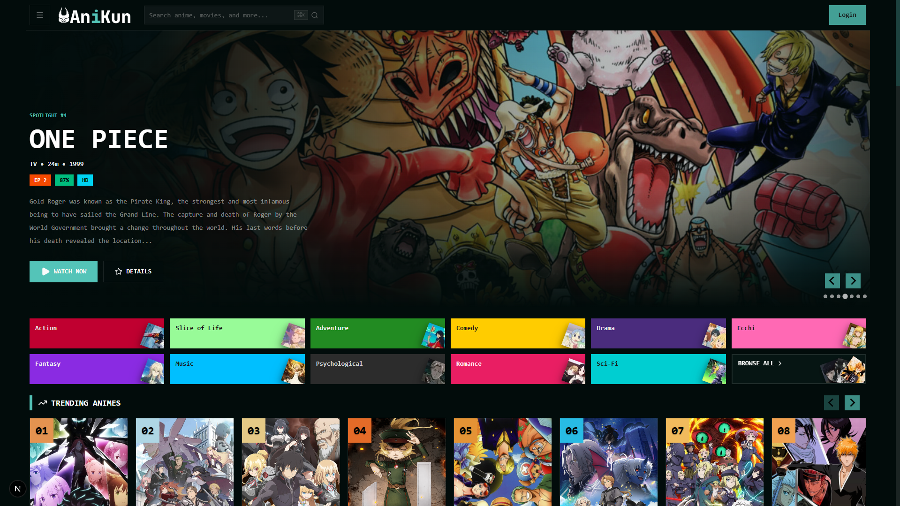

  
<h1 style="font-size: 30px;">More Screenshots</h1>

   

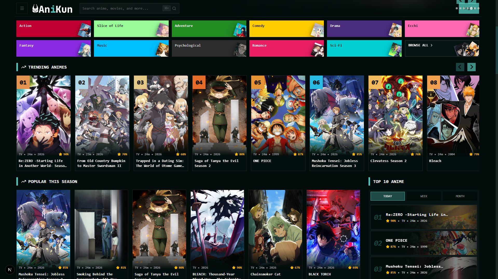
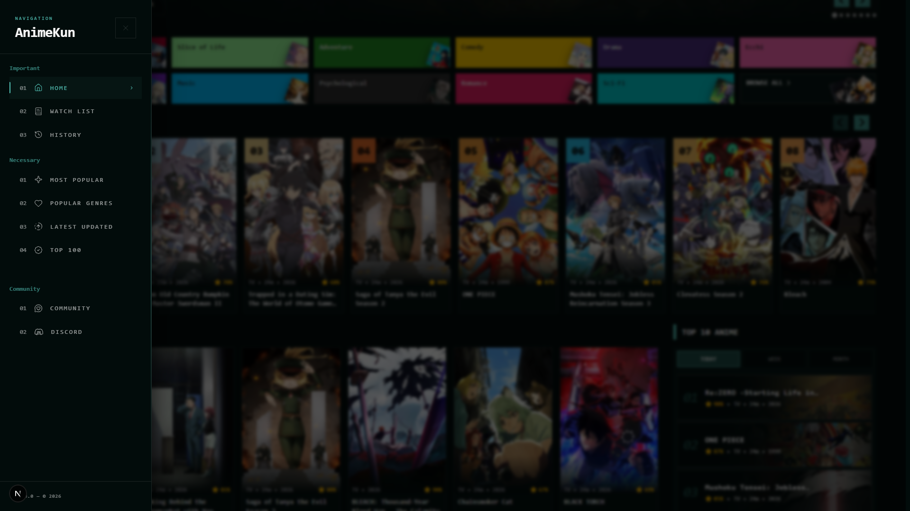
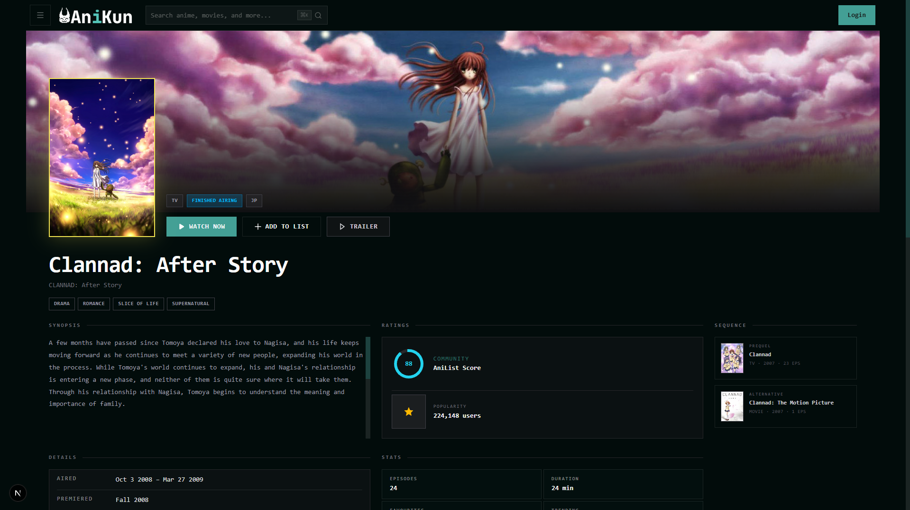
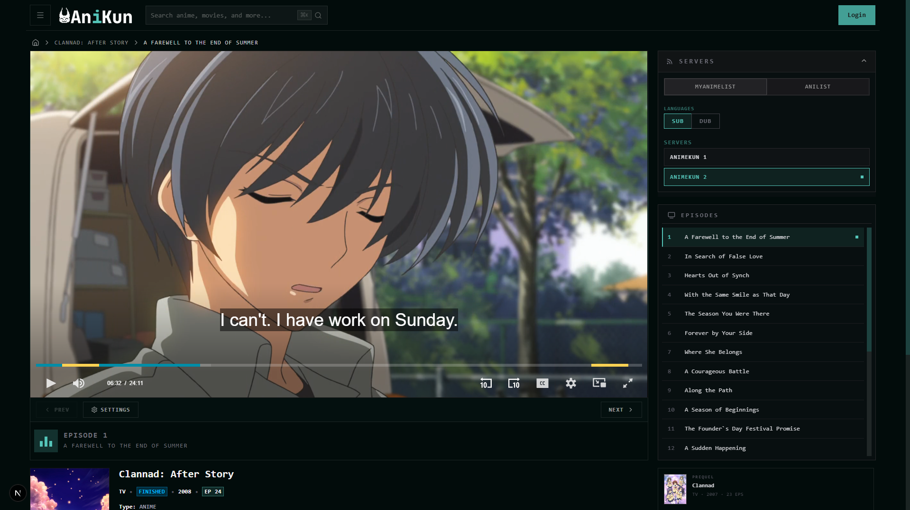
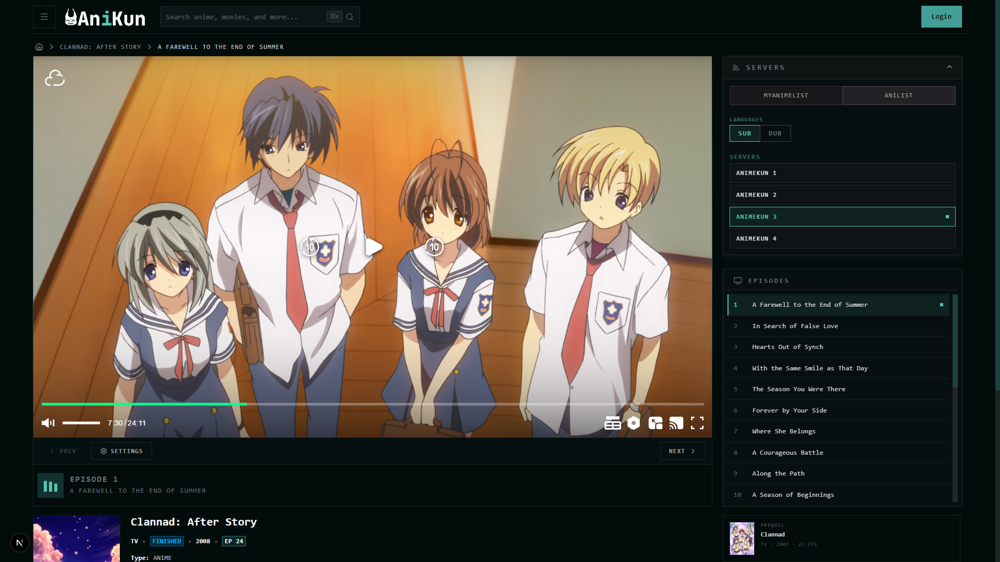
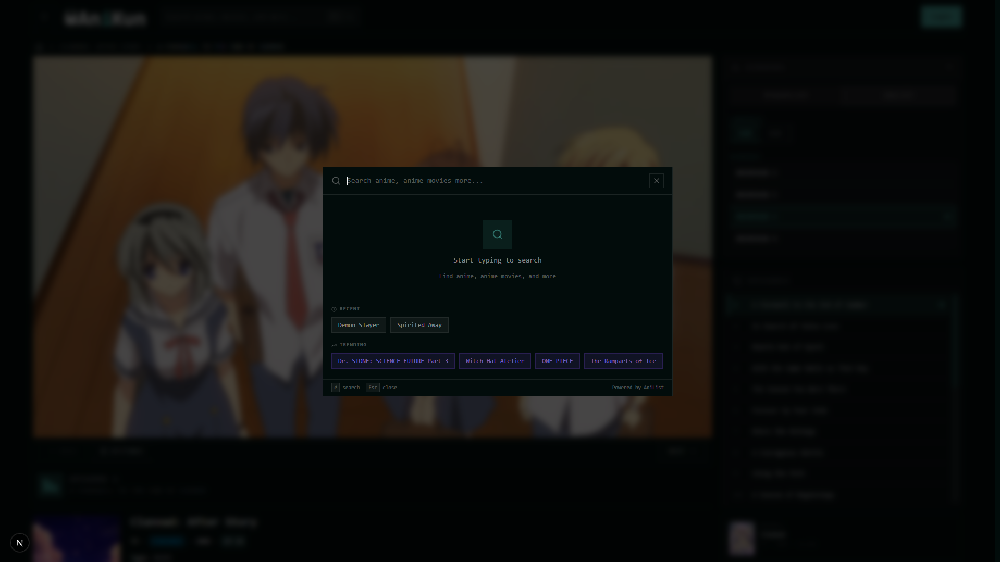
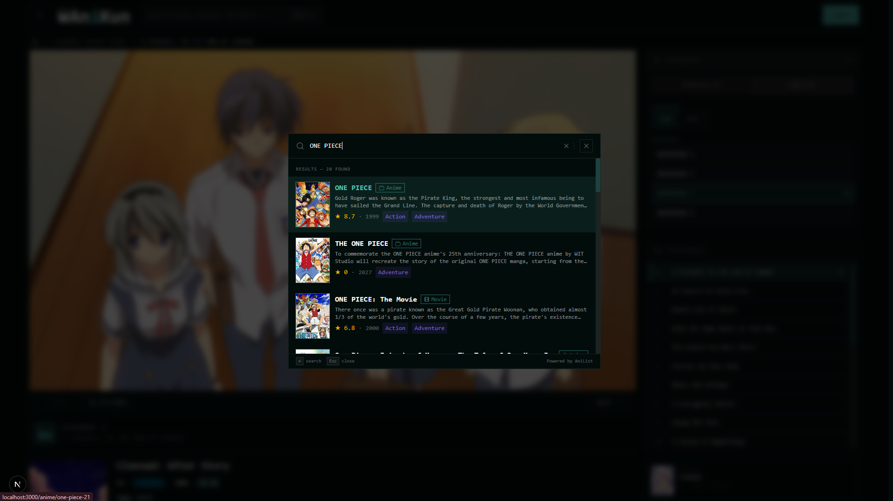
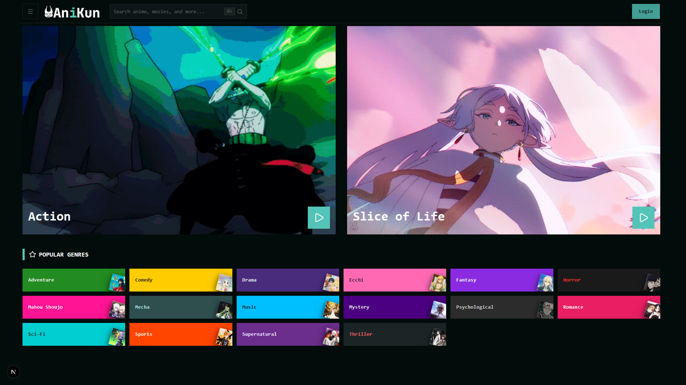
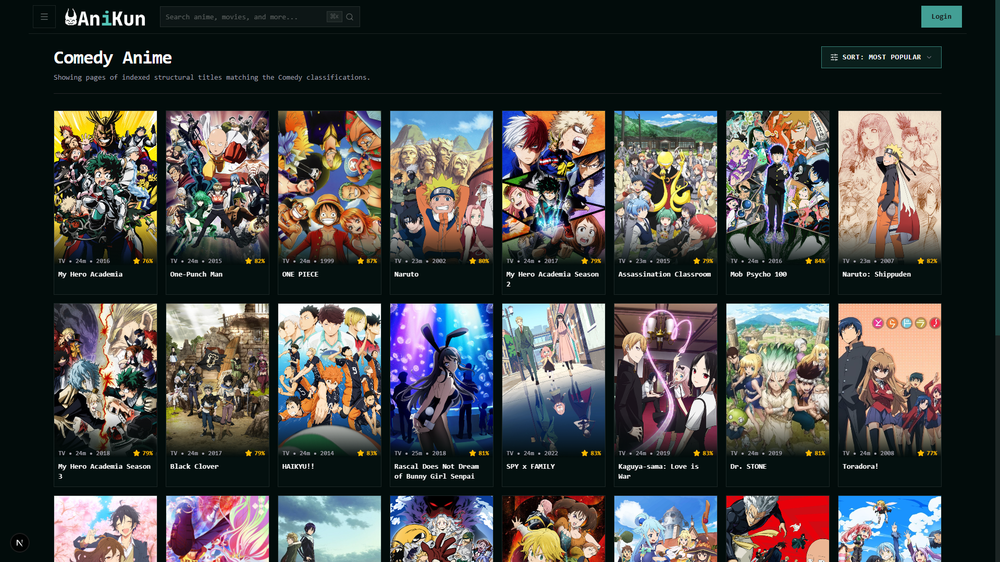
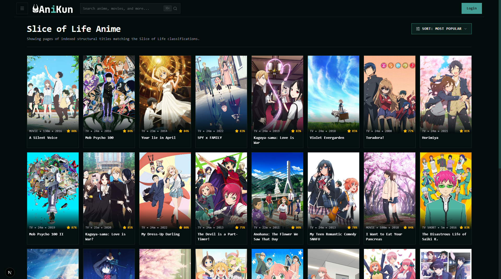

## Getting Started

For installation, local development, environment variables, and deployment instructions, see the [usage guide](docs/USAGE.md).

The applications also have their own documentation:

- [Main Frontend App](apps/site/README.md)
- [API App](apps/akapi/README.md)

## Contributing

Contributions are welcome. Please read [CONTRIBUTING.md](docs/CONTRIBUTING.md) before opening an issue or pull request.

## Support

If you like this project, consider giving it a <strong>star 🌟</strong>

Connect with me on X (Twitter): [@subhajeetch](https://x.com/subhajeetch) 
Join the Discord community: [Animekun](https://discord.gg/6DhssCN2Ph)

## License

This project is licensed under the [MIT License](LICENSE).
