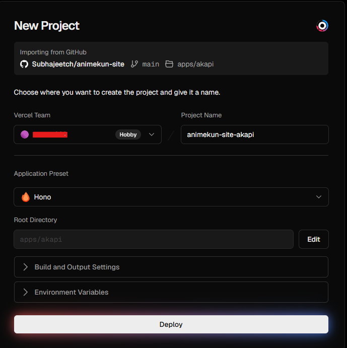
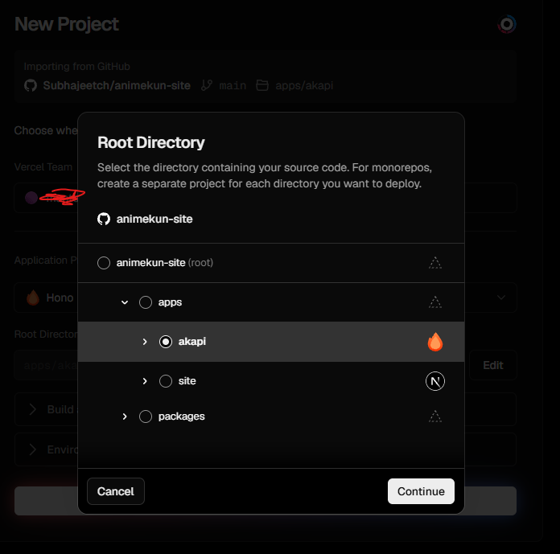

# API APP

AKAPI is the Hono-based API service used by the Animekun site during local development.

## Local development

From the repository root:

```bash
pnpm install
pnpm --filter hono dev
```

The server listens on [http://localhost:3001](http://localhost:3001) by default. Set the `PORT` environment variable to use a different port.

## Build and run

```bash
pnpm --filter hono build
pnpm --filter hono start
```

## Vercel Deploy

This hono project is best formatted for vercel deployment, use vercel to deploy.

### Step 1 - Select repo

Select this repo or your forked repo on Vercel,

You don't have to do anything for Application Preset, it'll automatically get it that it's a Hono project if u select the `Root directory` - 2nd Step.



### Step 2 - Select `Root directory` [important]

You HAVE TO select /apps/akapi



Now deploy and set the hosting URL in the site's environment as `API_URL`. Read more in the [site app README](../site/README.md).
