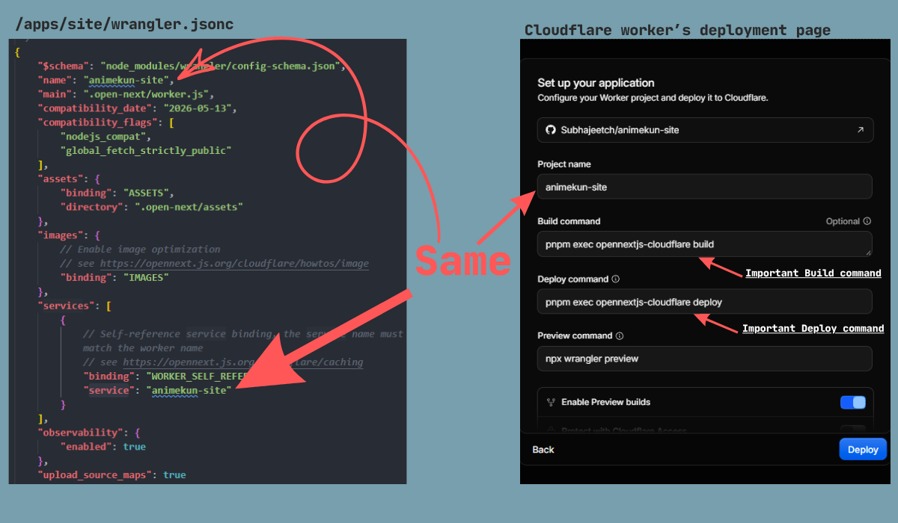
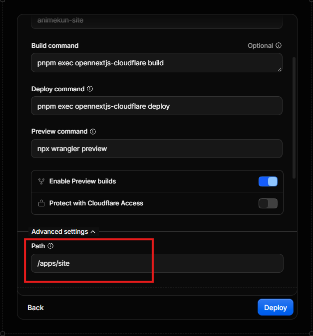
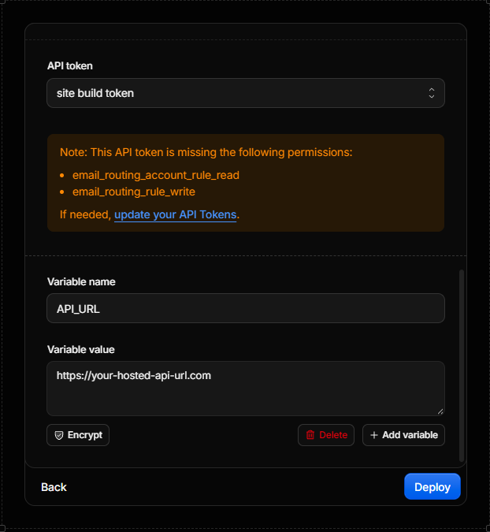
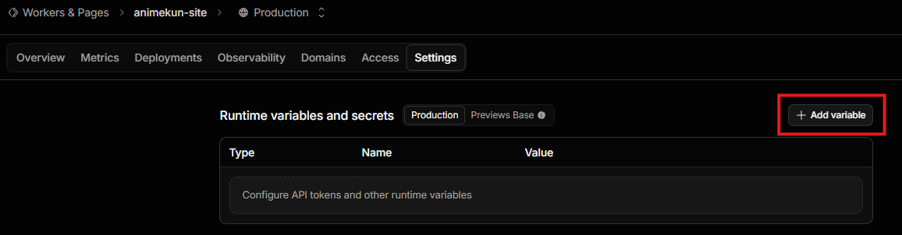
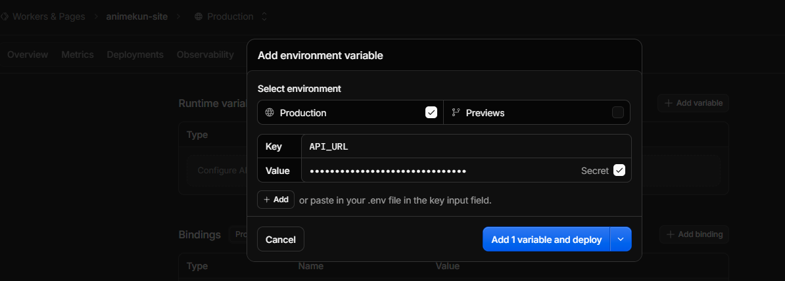

# Site

The site is the Animekun web application built with Next.js and deployed to Cloudflare Workers through [OpenNext](https://opennext.js.org/cloudflare).

## Local development

From the repository root:

```bash
pnpm install
cp apps/site/xx.env.local.example apps/site/.env.local
#just copies the env variables as normal env file.
pnpm --filter site dev
#to run both api & the website, use pnpm dev
```

Open [http://localhost:3000](http://localhost:3000). The default `API_URL` points to the local AKAPI service at `http://localhost:3001`; start that service in another terminal with `pnpm --filter hono dev` when needed.

## Cloudflare deployment

This project can be deployed on `vercel` as well as `cloudflare`. vercel is easy & cloudflare is fast & secure with their caching and routing rules so showing Cloudflare here:
`akapi` app needs to be hosted before this. Read [AKAPI App's README.md](../akapi/README.md) to know how to host it.

### Step 1 - Same Project name.

Go to cloudflare workers and select This repo or your forked repo.
Then for the Project name, it should be exactly same as (../site/wrangler.jsonc)'s `.name` & `services.service` value. example image:


### Step 2 - Build and Deploy command

For `Build command` use:

```bash
pnpm exec opennextjs-cloudflare build
```

For `Deploy Command` use:

```bash
pnpm exec opennextjs-cloudflare deploy
```

You can also see it on the image above.

### Step 3 - Select Root Directory [important]

Click `Advanced settings` and on the `Path` write:

```
/apps/site
```

Example image:


### Step 4 - ENV Variables

Scroll down and ignore `API token`
at last, on the `Variable name` & `Variable value` write your hosted API from vercel as shown:


> This value will only be used while building the app in production. You have to make env for runtime as well. see `step 5`

### Step 5 - ENV Variables

While the app is building, go to `settings` & locate `Runtime variables and secrets`. Then click `Add variable`. example image:


Then a DIALOG will appear with `Key` & `Value`, you have to write `API_URL` as key and `Your Hosted API` as value something like this:


> Click & Enable `Secret` or IT Will disappear on the next deployment (cloudflare bug hahaha)

Then Deploy with the blue button as shown on the image.

Now your Anime website is live and working.
